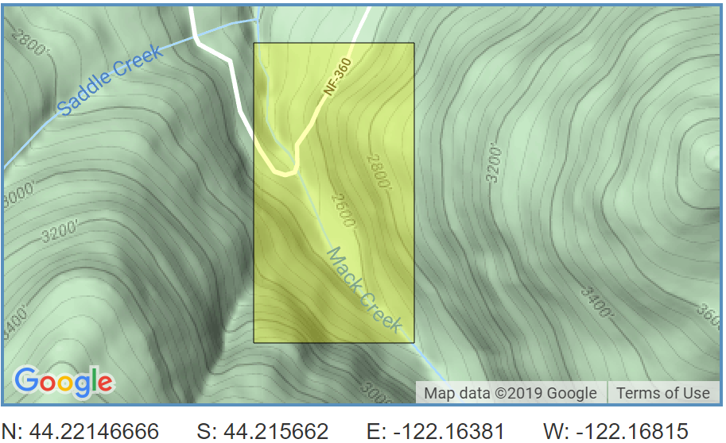

```{r setup, include=FALSE}
knitr::opts_chunk$set(echo = FALSE, message = FALSE, warning = FALSE)
library(tidyverse)
library(janitor)
library(effsize)
library(car)
library(ggbeeswarm)
library(kableExtra)
```

## Introduction

## Data and Methods

The data used in this analysis is from an aquatic vertebrate population study conducted in the H.J. Andrews Experimental Forest at Mack Creek, OR. Since 1993, the study has included length and weight measurements of Pacific Giant Salamanders as well as information about the environment where these samples were taken. The environmental data includes specific habitat information (pool, cascade, or side channels) and historical habitat data (clear cut forest vs old growth). Using preliminary data exploration methods such as QQ-plots and Levene's test for equality of variances, this report was able to determine whether parametric tests (T-test and ANOVA) were most appropriate for identifying significant difference among the collected samples. RStudio Version 1.2.1335 was used to conduct the statistical tests with a significance level of p < 0.05.


*Image from Google Maps*

Citation: Gregory S. V. 2016. Aquatic Vertebrate Population Study in Mack Creek, Andrews Experimental Forest, 1987 to present. Environmental Data Initiative. https://doi.org/10.6073/pasta/5de64af9c11579266ef20da2ff32f702. Dataset accessed 11/19/2019.

## Results
```{r}
#Read in Salamander Data
MC_Salamanders <- read_csv("mack_creek_vertebrates.csv") %>% 
  clean_names() %>% 
  filter(species == "DITE") %>%  
           mutate(river_type = (case_when(
            unittype == "C" ~ "Cascade", 
            unittype == "SC" ~ "Side Channel",
            unittype == "P" ~ "Pool"))) %>% 
  mutate(forest_type = (case_when(
            section == "OG" ~ "Old Growth",
            section == "CC" ~ "Clear Cut")))
```


```{r}
#Wrangle Data (Result A)
MC_annual_count <- MC_Salamanders %>%  
  filter(species == "DITE") %>% 
  group_by(year,forest_type) %>% 
  summarize(annual_count = n())
```

### Title for Result A
```{r}
#Graph Data (Result A)
ggplot(MC_annual_count, aes(x = year, y = annual_count)) +
geom_line(aes(color = forest_type),
            size = .5,
            show.legend = TRUE) + 
  geom_point(aes(year))+
   scale_x_continuous(limits = c(1993, 2017),
                     breaks = seq(1993, 2017, by = 1)) +
  scale_y_continuous(limits = c(0, 400),
                     breaks = seq(0, 500, by = 50)) + 
  theme_minimal()+ 
  labs(title = "Pacific Giant Salamander Counts in Old Growth and Clear Cut Forest",
       subtitle = "Mack Creek, HJ Andrews Experimental Forest, OR",
       x = "Year",
       y = "Salamander Count", 
       color = "Forest Condition") +
  theme(axis.text.x = element_text(angle= 45, 
                                   hjust = 1),
        axis.ticks = element_line(size = .5)) 
  
```

**Figure 1** *Salamander counts were recorded in both clear-cut and old-growth forests abutting Mack Creek for 25 years.*

```{r}
#Wrangle Data (Result B)
MC_2017_count <- MC_Salamanders %>% 
  filter(year == "2017") %>% 
  filter(unittype %in% c("P", "C", "SC")) %>% 
  count(river_type, forest_type)

MC_table <- MC_2017_count %>% 
  pivot_wider(names_from = river_type, values_from = n)

MC_proportion <- MC_table %>% 
  adorn_percentages(denominator = "row") %>% 
  adorn_pct_formatting(digits = 0)  %>% 
  rename("Forest Condition" = forest_type)
```

### Title for Result B
```{r}
#Table Data (Result B)
kable(MC_proportion) %>% 
  kable_styling(bootstrap_options = "basic") 
```

**Figure 2.** *Proportion of salamanders found in different stream types within clear-cut and old-growth forests during 2017.* 

### Title for Result C
```{r}
#Wrangle Data (Result C) 
Sal_chi_test <- MC_table %>%  
  pivot_longer(cols = c("Cascade","Pool", "Side Channel")) %>% 
  pivot_wider(names_from = forest_type) %>% 
  select(-name)
```

```{r}
#Chi-Squared Test (Result C)
Sal_chi_results <- chisq.test(Sal_chi_test)
```
Forest conditions do not affect the proportion of salamanders found in cascades, pools, or side channels. 
($\chi$^2^(`r Sal_chi_results$parameter`) = `r round(Sal_chi_results$statistic,2)`, p = `r round(Sal_chi_results$p.value, 3)`).

### Is there a significant difference in average weight between salamanders found in different forest environments? 
```{r}
# Data wrangling (Result D)
MC_weight_17 <- MC_Salamanders %>% 
  filter(species == "DITE") %>%
  filter(year == 2017) %>% 
  select(forest_type, weight)
```


Let's compare weights of Pacific giant salamanders in clear cut and old growth forest sections of the creek in 2017.
```{r}
# Explore data (Result D)
ggplot(data = MC_weight_17, aes(sample = weight)) +
  geom_qq(aes(color = forest_type),
                 alpha = 0.5,
                 show.legend = FALSE) +
  facet_wrap(~forest_type, scales = "free") +
  labs(title = "Q-Q Plot Salamander Weight", 
       subtitle = "Comparison of different forest environments ~ 2017",
       y = "Weight [g]", x = "Theorectical") +
  theme_minimal()

# Shows non-normal distribution. Need to check for significant difference in variances before attempting parametric test
```

**Figure 3.** *Although data is not normally distrubted (lack of linear relationship), both plots look like they could have similar variance*

These plots do not show a linear relationship between the actual distribution of the data and the theoretical normal dsitrbution. Therefore, we can conclude that the data is not normally distributed and an equal varaiance test will be necessary to determine what statistical test is most appropriate.
```{r}
ltest <- leveneTest(weight ~ forest_type, data = MC_weight_17)
ltest

# Does not detect a significant difference in variances, therefore parametric test assumptions are verified
```

The Levene equal variance test does not detect a significant difference in variance. As indicated by the p-value of `r round(ltest$"Pr(>F)"[1], 2)`, we do not have significant evidence to reject the null hypothesis that variance among these datasets are the same. Since variance is equal among the samples we can conduct a t-test to check for a significant difference in means.
```{r}
MC_og_sample <- MC_weight_17 %>% 
  filter(forest_type == "Old Growth") 

MC_cc_sample <- MC_weight_17 %>% 
  filter(forest_type == "Clear Cut")


MC_weight_ttest <- t.test(MC_og_sample$weight, MC_cc_sample$weight)
MC_weight_ttest

# Does not detect a significant difference in weight between the two groups. However, means are very close together and data was not nomrally distrubted to begin with, so this test might not be the most accurate.
```

The t-test results (p-value = `r round(MC_weight_ttest$p.value, 2)`) fail to reject the null hypothesis. This implies that there is not a significant difference in average weight between the two salamander groups.

### Is Pacific giant salamander weight significantly different among various water environments? 
```{r}
# Data wrangling (Result E)
MC_rtype_17 <- MC_Salamanders %>% 
  filter(species == "DITE", year == 2017, 
         river_type %in% c("Cascade", "Side Channel", "Pool")) %>%
  select(river_type, weight)

MC_rtype_summary <- MC_rtype_17 %>% 
  group_by(river_type) %>% 
  summarize(
    mean_weight = mean(weight, na.rm = TRUE),
    sd_weight = sd(weight, na.rm = TRUE),
    sample_size = n(),
    se_weight = sd(weight, na.rm = TRUE) / sqrt(n()),
    var_weight = var(weight, na.rm = TRUE)
  )
```

Let's compare the weights of Pacific giant salamanders grouped by their location (cascasde, side channel, pool) in 2017.
```{r}
# Explore data (Result E)
ggplot() +
  geom_beeswarm(data = MC_rtype_17, dodge.width = 0.8,
                aes(x = river_type, y = weight, 
                    color = river_type, pch = river_type),
                size = 2, alpha = 0.6, show.legend = FALSE) +
  geom_point(data = MC_rtype_summary, 
             aes(x = river_type, y = mean_weight),
             color = "firebrick", size = 3) +
  geom_errorbar(data = MC_rtype_summary,
                aes(x = river_type,
                    ymin = mean_weight - sd_weight,
                    ymax = mean_weight + sd_weight),
                color = "firebrick", width = 0.1) +
  labs(title = "Salamander Weight Distributions", 
       subtitle = "Comparison of different water environments ~ 2017",
       y = "Weight [g]", x = "Water source") +
  theme_minimal()
```

**Figure 4.** *This plot shows the weight distribution among the three factor levels. The error bars are centered about the respective mean and error is represented as $\pm$ one standard deviation.*

This beewswarm plot reveals the skew of the data. Most of the captured salamanders are small with a few quite large outliers.
```{r}
# Test for significant difference

ggplot(data = MC_rtype_17, aes(sample = weight)) +
  geom_qq(aes(color = river_type),
                 alpha = 0.5,
                 show.legend = FALSE) +
  facet_wrap(~river_type, scales = "free") +
  labs(title = "QQ-Plot Salamander Weight", 
       subtitle = "Comparison of different water environments ~ 2017",
       y = "Weight [g]", x = "Theorectical") +
  theme_minimal()

# Shows non-normal distribution. Need to check for significant difference in variances before attempting parametric test
```

**Figure 5.** *Similar to the previous Q-Q plot, this figure shows a non-normal distribution.* 

Because data is not normally distributed, to proceed with a parametric test we first need to check for a significant difference in variances.
```{r}
ltest2 <- leveneTest(weight ~ river_type, data = MC_rtype_17)
ltest2

# Does not detect a significant difference in variances, therefore ANOVA test assumptions are verified
```

Levene's Test does not detect a significant difference in variances (p-value = `r round(ltest2$"Pr(>F)"[1], 2)`). This means we can proceed with an ANOVA test.
```{r}
MC_rtype_aov <- aov(weight ~ river_type, data = MC_rtype_17)
summary(MC_rtype_aov)

# Does detect a significant difference in weight between the groups. Now we need to use Tukey's HSD to find which group-paring differs.
```

The ANOVA test detects a significant difference (p-value < 0.05) in mean weight, but we need to use Tukey's HSD to find which group pairing differs.
```{r}
TukeyHSD(MC_rtype_aov)

# Shows that there is significant difference in weight between Salamanders from Side Channel compared to Pool locations
```

Tukey's HSD reveals that the significant difference in mean weight is only between salamanders collected from pools and the side channel area. Lastly, an effect size test is necessary to strength the validity of our conclusion.  
```{r}
MC_rtype_A <- MC_rtype_17 %>% 
  filter(river_type == "Side Channel")

MC_rtype_B <- MC_rtype_17 %>% 
  filter(river_type == "Pool")

MC_cohen_d <- cohen.d(MC_rtype_A$weight, MC_rtype_B$weight)
MC_cohen_d

# Cohen's D shows a small effect size incresaing our confidence in data results 

# Problem with comapring means: data is not normally distrubted, so a better measurement could be medians 
```

Cohen's D shows a small effect size (`r round(MC_cohen_d$estimate, 2)`) incresaing our confidence in data results. Unfortunately these results are based in parametric tests that focus on comparing means. Because weight is not normally distributed, means may not be the best representative measure of that data. Additonally, means are heavily influenced by outliers which are apparent in the Q-Q plots. Medians would be a better metric to compare as they take into the account the skew inherit in the weight distribution.  